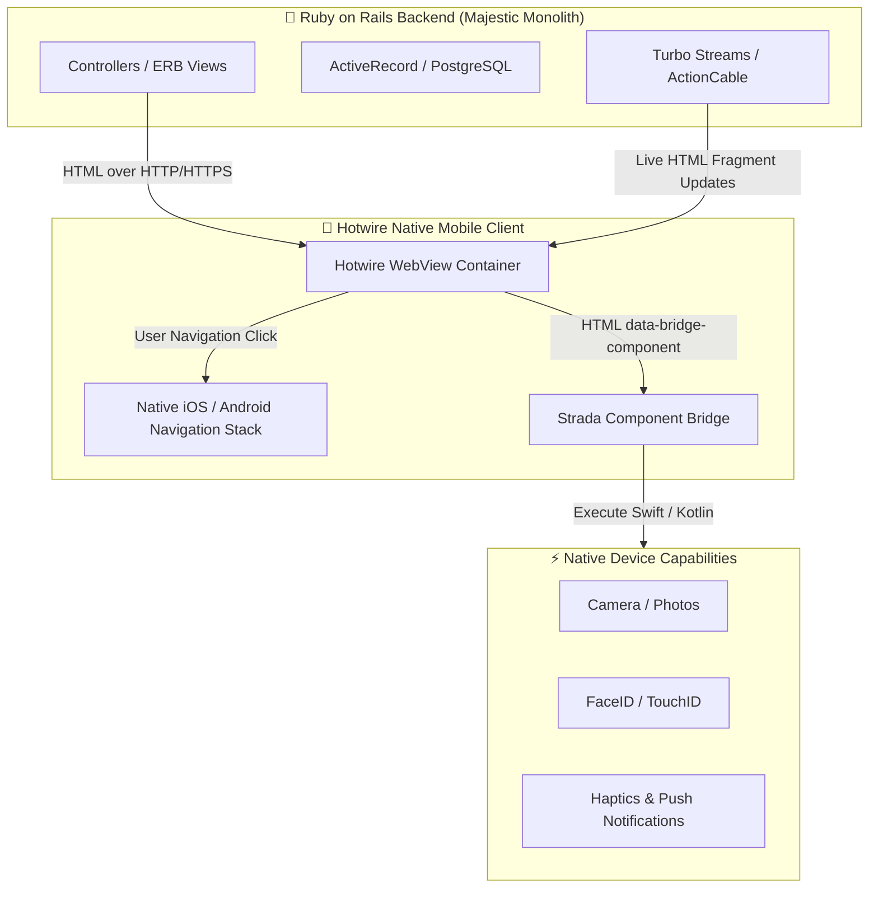

<div class="flex flex-col items-center justify-center h-full px-4">
  
  <div class="flex items-center gap-2 mb-4">
    <span class="rails-badge">💎 Ruby on Rails</span>
    <span class="hotwire-badge">⚡ Hotwire Native</span>
    <span class="px-3 py-1 rounded-full text-xs font-mono font-bold bg-slate-800 text-slate-300 border border-slate-700">
      COSCUP 2026
    </span>
  </div>

  <h1 class="text-5xl font-extrabold tracking-tight mb-4">
    Building Native Mobile Apps<br>
    <span class="text-transparent bg-clip-text bg-gradient-to-r from-red-500 via-amber-400 to-red-400">
      Using Rails
    </span>
  </h1>

  <p class="text-xl text-slate-300 max-w-2xl mx-auto font-medium mb-8">
    How to ship production iOS & Android apps at 5x speed using Hotwire Native, Strada, and your existing Rails backend.
  </p>

  <div class="flex items-center justify-center gap-4 text-sm font-semibold">
    <div class="flex items-center gap-2 bg-slate-900/80 px-4 py-2 rounded-xl border border-red-500/30">
      <span class="w-2.5 h-2.5 rounded-full bg-red-500 animate-pulse"></span>
      <span class="text-white">Speaker:</span>
      <span class="text-red-400 font-bold">Nebiyu Elias Talefe</span>
    </div>
    <div class="bg-slate-900/80 px-4 py-2 rounded-xl border border-slate-700 text-slate-300 font-mono text-xs">
      Aug 8, 2026
    </div>
  </div>

</div>

---
transition: fade-out
layout: default
---

<div class="flex justify-between items-center mb-2">
  <span class="rails-badge">👨‍💻 About The Speaker</span>
  <span class="text-xs font-mono text-slate-400">COSCUP 2026</span>
</div>

# Hi, I'm Nebiyu Elias Talefe 👋

<SpeakerCard />

<div class="grid grid-cols-3 gap-3 mt-3 text-xs">
  <div class="p-3 bg-slate-900/70 rounded-xl border border-slate-800">
    <div class="text-red-400 font-bold text-sm mb-1">🚀 7+ Years Experience</div>
    <p class="text-slate-300 m-0">Full-stack architect building scalable web systems and hybrid native mobile apps.</p>
  </div>
  <div class="p-3 bg-slate-900/70 rounded-xl border border-slate-800">
    <div class="text-amber-400 font-bold text-sm mb-1">💎 Rails & Hotwire Specialist</div>
    <p class="text-slate-300 m-0">Creator of Hotwire Native starter templates & production Rails multi-platform suites.</p>
  </div>
  <div class="p-3 bg-slate-900/70 rounded-xl border border-slate-800">
    <div class="text-emerald-400 font-bold text-sm mb-1">💼 Open for Opportunities</div>
    <p class="text-slate-300 m-0">Available for Senior/Lead Full-Stack roles, Rails consulting, and contract engineering.</p>
  </div>
</div>

---
transition: slide-up
---

<div class="flex justify-between items-center mb-2">
  <span class="rails-badge">⚠️ The Problem</span>
  <span class="text-xs font-mono text-slate-400">Traditional Mobile Stacks</span>
</div>

# The Mobile Development Dilemma

Traditional mobile app development forces small teams to choose between **massive overhead** or **subpar UX**:

<div class="grid grid-cols-2 gap-4 mt-6">
  
  <div class="p-4 bg-slate-900/80 rounded-2xl border border-red-500/20 text-left">
    <h3 class="text-lg font-bold text-red-400 flex items-center gap-2 mb-2">
      <span>📱</span> Option A: Separate Native Apps
    </h3>
    <ul class="text-xs text-slate-300 space-y-2 pl-4 list-disc">
      <li><strong>3 Codebases:</strong> Rails Backend + Swift (iOS) + Kotlin (Android).</li>
      <li><strong>Tripled Team Size:</strong> Need specialized iOS and Android engineers.</li>
      <li><strong>Duplicated Business Logic:</strong> Validations & state logic written 3 times.</li>
      <li><strong>Slow Releases:</strong> App Store review queues for every single UI tweak.</li>
    </ul>
  </div>

  <div class="p-4 bg-slate-900/80 rounded-2xl border border-amber-500/20 text-left">
    <h3 class="text-lg font-bold text-amber-400 flex items-center gap-2 mb-2">
      <span>⚛️</span> Option B: React Native / Flutter
    </h3>
    <ul class="text-xs text-slate-300 space-y-2 pl-4 list-disc">
      <li><strong>API Boundary Tax:</strong> Write JSON serializers, endpoints, and client state sync.</li>
      <li><strong>Framework Layer Overhead:</strong> JS bridge friction and custom native module bugs.</li>
      <li><strong>Duplicated Auth & State:</strong> Redux/Zustand mirroring server database state.</li>
      <li><strong>Maintenance Burden:</strong> Constant dependency upgrades and breaking changes.</li>
    </ul>
  </div>

</div>

<div class="mt-6 p-3 bg-red-950/30 rounded-xl border border-red-500/40 text-center font-bold text-sm text-red-300">
  ❓ What if your single Rails backend COULD BE your iOS and Android mobile app?
</div>

---
transition: slide-left
---

<div class="flex justify-between items-center mb-2">
  <span class="hotwire-badge">💡 The Solution</span>
  <span class="text-xs font-mono text-slate-400">HTML Over The Wire</span>
</div>

# Enter Hotwire Native ⚡

Hotwire Native brings DHH & 37signals' battle-tested strategy (used in HEY & Basecamp) to your app.

<div class="grid grid-cols-3 gap-4 mt-6 text-left">
  
  <div class="p-4 bg-slate-900/90 rounded-2xl border border-blue-500/30">
    <div class="w-10 h-10 rounded-xl bg-blue-600/20 text-blue-400 font-bold flex items-center justify-center text-xl mb-3">
      🌐
    </div>
    <h3 class="text-base font-bold text-white mb-1">Server-Driven HTML</h3>
    <p class="text-xs text-slate-300 leading-relaxed m-0">
      Your Rails views render standard HTML. Hotwire Native displays it instantly inside native WebView wrappers.
    </p>
  </div>

  <div class="p-4 bg-slate-900/90 rounded-2xl border border-red-500/30">
    <div class="w-10 h-10 rounded-xl bg-red-600/20 text-red-400 font-bold flex items-center justify-center text-xl mb-3">
      📱
    </div>
    <h3 class="text-base font-bold text-white mb-1">Native Navigation Shell</h3>
    <p class="text-xs text-slate-300 leading-relaxed m-0">
      Links push real iOS `UINavigationController` and Android activities onto the screen stack.
    </p>
  </div>

  <div class="p-4 bg-slate-900/90 rounded-2xl border border-purple-500/30">
    <div class="w-10 h-10 rounded-xl bg-purple-600/20 text-purple-400 font-bold flex items-center justify-center text-xl mb-3">
      🌉
    </div>
    <h3 class="text-base font-bold text-white mb-1">Strada Native Bridge</h3>
    <p class="text-xs text-slate-300 leading-relaxed m-0">
      Connect web HTML components directly to native Swift/Kotlin components (Camera, Haptics, Sheets).
    </p>
  </div>

</div>

<div class="mt-6 flex items-center justify-center gap-6 text-xs text-slate-300 bg-slate-950 p-3 rounded-xl border border-slate-800">
  <span class="flex items-center gap-1 font-bold text-emerald-400">✅ 90%+ Code Reuse</span>
  <span class="flex items-center gap-1 font-bold text-blue-400">⚡ Instant Server Deploys</span>
  <span class="flex items-center gap-1 font-bold text-purple-400">🚀 1 Small Rails Team</span>
</div>

---
transition: fade-out
---

<div class="flex justify-between items-center mb-2">
  <span class="hotwire-badge">📱 Interactive Demo</span>
  <span class="text-xs font-mono text-slate-400">How It Works On Device</span>
</div>

# Hotwire Native In Action 🎬

<div class="grid grid-cols-2 gap-6 items-center">
  <div class="text-left space-y-4">
    <div class="p-3 bg-slate-900/80 rounded-xl border border-slate-800">
      <h4 class="text-sm font-bold text-red-400 m-0 mb-1">1. Server HTML Render</h4>
      <p class="text-xs text-slate-300 m-0">
        Rails controllers serve normal ERB views. Changing copy or layout updates mobile users immediately.
      </p>
    </div>

    <div class="p-3 bg-slate-900/80 rounded-xl border border-slate-800">
      <h4 class="text-sm font-bold text-blue-400 m-0 mb-1">2. Native Navigation Stack</h4>
      <p class="text-xs text-slate-300 m-0">
        Path Configuration (`path_configuration.json`) routes URLs to native sheets, modals, and tab bars.
      </p>
    </div>

    <div class="p-3 bg-slate-900/80 rounded-xl border border-slate-800">
      <h4 class="text-sm font-bold text-purple-400 m-0 mb-1">3. Strada Native Bridge</h4>
      <p class="text-xs text-slate-300 m-0">
        HTML attributes (`data-bridge-component`) trigger native Swift and Kotlin UI components.
      </p>
    </div>
  </div>

  <div>
    <MobilePhoneMockup />
  </div>
</div>

---
transition: slide-up
---

<div class="flex justify-between items-center mb-2">
  <span class="rails-badge">📐 Architecture</span>
  <span class="text-xs font-mono text-slate-400">System Flow</span>
</div>

# High Level Architecture 🏗️



---
transition: slide-left
---

<div class="flex justify-between items-center mb-2">
  <span class="rails-badge">💻 Rails Code</span>
  <span class="text-xs font-mono text-slate-400">app/controllers/posts_controller.rb</span>
</div>

# 1. Server-Driven Rails Views 💎

One Rails Controller serves your Web app and Native Mobile app seamlessly:

```ruby {all|4-8|10-15}
class PostsController &lt; ApplicationController
  before_action :authenticate_user!

  def index
    @posts = Post.order(created_at: :desc)
    # Serves HTML to both Web browser and Hotwire Native iOS/Android clients!
    render :index
  end

  def create
    @post = current_user.posts.build(post_params)
    if @post.save
      respond_to do |format|
        format.html { redirect_to @post, notice: "Post published!" }
        format.turbo_stream # Live update mobile feed!
      end
    end
  end
end
```

<div class="mt-3 p-3 bg-slate-950 rounded-lg border border-slate-800 text-xs text-left">
  💡 <strong class="text-red-400">Pro Tip:</strong> Use `turbo_native_app?` in ERB helpers to tweak mobile-specific layouts or hide web header bars!
</div>

---
transition: slide-up
---

<div class="flex justify-between items-center mb-2">
  <span class="hotwire-badge">⚙️ Config</span>
  <span class="text-xs font-mono text-slate-400">path_configuration.json</span>
</div>

# 2. Native Navigation Stack Config 🗺️

Control native iOS/Android navigation behavior **from your Rails server** dynamically!

```json {all|3-10|12-22}
{
  "settings": {
    "tabs": [
      { "title": "Feed", "url": "/", "icon": "house" },
      { "title": "Explore", "url": "/explore", "icon": "magnifyingglass" },
      { "title": "Notifications", "url": "/notifications", "icon": "bell" },
      { "title": "Profile", "url": "/profile", "icon": "person" }
    ]
  },
  "rules": [
    {
      "patterns": ["/posts/new$", "/settings$"],
      "properties": {
        "presentation": "modal"
      }
    },
    {
      "patterns": ["/login$"],
      "properties": {
        "presentation": "clear_all"
      }
    }
  ]
}
```

---
transition: slide-left
---

<div class="flex justify-between items-center mb-2">
  <span class="rails-badge">🌉 Strada</span>
  <span class="text-xs font-mono text-slate-400">HTML to Native Bridge</span>
</div>

# 3. Leveling Up with Strada ⚡

Strada bridges web HTML elements to native Swift (iOS) and Kotlin (Android) components.

<StradaVisualizer />

<div class="grid grid-cols-2 gap-4 mt-3 text-left">
<div>
  <div class="font-bold text-red-400 text-xs mb-1">HTML View (ERB)</div>

```html
<form data-controller="bridge--form"
      data-bridge--form-title-value="Save Post">
  <!-- Rails Form Fields -->
</form>
```
</div>

<div>
  <div class="font-bold text-purple-400 text-xs mb-1">Native Swift Component</div>

```swift
class FormComponent: BridgeComponent {
  override class var name: String { "form" }
  // Renders native iOS bar submit button!
}
```
</div>
</div>

---
transition: fade-out
---

<div class="flex justify-between items-center mb-2">
  <span class="rails-badge">📊 Comparison</span>
  <span class="text-xs font-mono text-slate-400">Why Hotwire Native Wins</span>
</div>

# React Native vs Rails + Hotwire Native ⚔️

<ComparisonMatrix />

<div class="p-3 bg-red-950/40 border border-red-500/30 rounded-xl text-center text-xs text-red-200 font-medium">
  🚀 <strong>Result:</strong> 1 developer can build and ship what traditionally required a 5-person mobile + backend team!
</div>

---
transition: slide-up
---

<div class="flex justify-between items-center mb-2">
  <span class="rails-badge">⭐ Starter Template</span>
  <span class="text-xs font-mono text-slate-400">Open Source</span>
</div>

# Nebiyu's Rails Mobile Starter Template 🛠️

I built an open-source starter template so you can launch your mobile Rails app today:

<div class="bg-slate-900/90 border border-amber-500/40 rounded-2xl p-5 text-left my-3 shadow-xl">
  <div class="flex items-center justify-between border-b border-slate-800 pb-3 mb-3">
    <div class="flex items-center gap-3">
      <div class="w-10 h-10 rounded-xl bg-gradient-to-br from-red-600 to-amber-500 flex items-center justify-center text-xl font-bold text-white shadow">
        🚀
      </div>
      <div>
        <h3 class="text-lg font-black text-white m-0">turbo-rails-react-native-starter</h3>
        <p class="text-xs text-amber-400 font-mono m-0">github.com/nebiyuelias1/turbo-rails-react-native-starter</p>
      </div>
    </div>
    <span class="px-3 py-1 bg-amber-500/20 text-amber-300 border border-amber-500/40 rounded-full text-xs font-bold">
      ⭐ Star on GitHub
    </span>
  </div>

  <div class="grid grid-cols-2 gap-4 text-xs">
    <div class="space-y-1.5 text-slate-300">
      <div class="flex items-center gap-2">✅ <strong>Pre-configured Auth:</strong> Devise + Session tokens</div>
      <div class="flex items-center gap-2">✅ <strong>Native iOS and Android:</strong> Ready to build</div>
      <div class="flex items-center gap-2">✅ <strong>Strada Bridges:</strong> Form and Haptic bridges</div>
    </div>
    <div class="space-y-1.5 text-slate-300">
      <div class="flex items-center gap-2">✅ <strong>Dark Mode:</strong> Tailwind CSS and CSS variables</div>
      <div class="flex items-center gap-2">✅ <strong>Turbo Streams:</strong> WebSocket and ActionCable</div>
      <div class="flex items-center gap-2">✅ <strong>CI/CD:</strong> GitHub Actions workflow included</div>
    </div>
  </div>
</div>

```bash
# Quick Start:
git clone https://github.com/nebiyuelias1/turbo-rails-react-native-starter.git
cd turbo-rails-react-native-starter && bundle install
bin/rails s
```

---
transition: slide-left
---

<div class="flex justify-between items-center mb-2">
  <span class="rails-badge">🎯 Best Practices</span>
  <span class="text-xs font-mono text-slate-400">Production Playbook</span>
</div>

# Lessons from Building Hotwire Apps 🧠

<div class="grid grid-cols-2 gap-4 text-left mt-4">
  
  <div class="p-4 bg-slate-900/80 rounded-xl border border-slate-800">
    <h4 class="text-sm font-bold text-red-400 mb-2">1. Cache Strategy and Speed</h4>
    <p class="text-xs text-slate-300 m-0 leading-relaxed">
      Use Turbo cache snapshots for instant page restores. Serve static assets via CDN and leverage HTTP caching headers for lightning-fast screen transitions.
    </p>
  </div>

  <div class="p-4 bg-slate-900/80 rounded-xl border border-slate-800">
    <h4 class="text-sm font-bold text-blue-400 mb-2">2. When to Go Native</h4>
    <p class="text-xs text-slate-300 m-0 leading-relaxed">
      Keep 90% of screens as web HTML. Build Strada components for heavy native features like camera capture, barcode scanning, biometrics, or real-time maps.
    </p>
  </div>

  <div class="p-4 bg-slate-900/80 rounded-xl border border-slate-800">
    <h4 class="text-sm font-bold text-purple-400 mb-2">3. Offline Experience</h4>
    <p class="text-xs text-slate-300 m-0 leading-relaxed">
      Handle offline fallback screens natively with custom offline HTML pages embedded in your iOS and Android app bundles.
    </p>
  </div>

  <div class="p-4 bg-slate-900/80 rounded-xl border border-slate-800">
    <h4 class="text-sm font-bold text-amber-400 mb-2">4. App Store Compliance</h4>
    <p class="text-xs text-slate-300 m-0 leading-relaxed">
      Apple and Google fully support Hotwire Native apps (Basecamp and HEY have millions of users). Ensure native Apple Pay / IAP for digital goods if required.
    </p>
  </div>

</div>

---
transition: fade-out
class: text-center ruby-hero
---

<WrapUpSlide />
